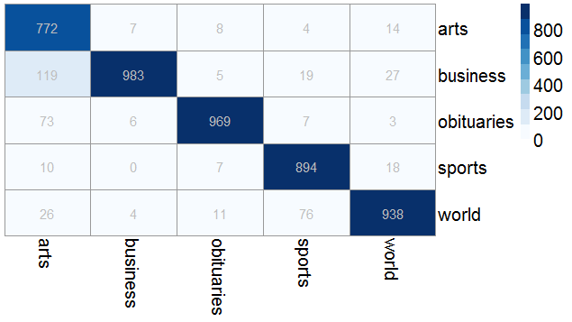

## Readme

Code for [NYT API](https://developer.nytimes.com/,"https://developer.nytimes.com/") scraping and code for scraping articles body. 

Code does following:

- __reads articles metadata__ from NYT API. Use function `getMetaData()` (all the functions are in [NYT_functions.R](https://github.com/RRisto/NYT-article-classification/blob/master/NYT_functions.R "https://github.com/RRisto/NYT-article-classification/blob/master/NYT_functions.R") file). Functions first checks if there are any articles in period you want to scrape. If there isn't error is shown and function stops (and asks to check nrOfArticles, dayStep and/or dayStep arguments values). If nrOfArticles is bigger than then real number of articles, goal is never reached. Also by default function makes calls for daily time chunck going backwards in time. But some articles (like obituaries section ones) are very very rare in every day, it is reasonable to find bigger time chunk. You must remember that max 1000 call per day could be made via API (after that error is returned on call). If you want to have all the articles from some time period daily time chunks are ok (for each day you make a query maximum for 1000 articles metadata could be received, read more about it in API documentation).

- __scrapes articles bodies__ from the web based on url recevied with metadata. Function `getArticleBody()` helps to achieve it. If no article body is found, function saves it as `NA`.

- __prepares data for modelling__ by removing stopwords, stemming, making training and test data, etc. 

- __uses Naive Bayes to make model__ for classifiyng articles by section. Sections used are arts, business, obituaries, sports, world. Model accuracy is on test data (1000 articles per section) is `0.9112`. Accuracy matrix is here:

  

__X-axis__ shows what was articles real class, __y-axis__ shows what was predicted class. For example there were 1000 articles in arts section that were used for testing. 772 of them were classified as arts section articles, 119 of them were classified as businesss section articles (and so were misclassified) and so on.

If you want to follow this data collecting and modelling, use script [NY_times.R](https://github.com/RRisto/NYT-article-classification/blob/master/NY_times.R "https://github.com/RRisto/NYT-article-classification/blob/master/NY_times.R")
